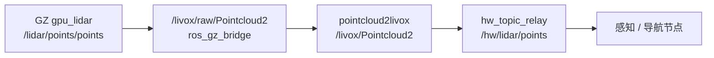

# SimEnv 话题接口对照表

更新时间：2026-07-04  
适用对象：平台组、集成与测试组、各算法组  
目的：说明 **官方 SimEnv（ROS1）**、**SimEnv_ROS2 迁移栈**、**HazardWalker 队内 `/hw/*`** 三层接口的对应关系。

---

## 1. 三层架构（先看这个）

SimEnv_ROS2 运行时，传感器数据会经过最多 **三层** 转发，平台组看到「话题比官方多」是正常现象：

```text
┌─────────────────┐    ros_gz_bridge     ┌──────────────────────┐    pointcloud2livox     ┌─────────────────┐    hw_topic_relay      ┌──────────────────┐
│ Gazebo Harmonic │ ──────────────────► │ SimEnv 兼容话题层 (B) │ ─────────────────────► │ /livox/* 等      │ ───────────────────► │ HazardWalker     │
│ (GZ 原生话题)    │                      │ /livox/raw/* 等 (A)  │                        │ 与官方 ROS1 对齐  │   仅改话题名、不改内容  │ /hw/* 算法接口 (C) │
└─────────────────┘                      └──────────────────────┘                        └─────────────────┘                      └──────────────────┘
```

| 层级 | 命名风格 | 谁该关心 |
|------|----------|----------|
| **A** Gazebo 桥接 | `/livox/raw/*`、`/simenv/camera/*` | 平台组调试 Harmonic 传感器 |
| **B** SimEnv 兼容 | `/livox/Pointcloud2`、`/Odometry_gazebo` 等 | 对齐官方 ROS1 SimEnv 行为 |
| **C** HazardWalker | `/hw/*` | 导航 / 感知 / 决策算法节点 |

**要点：**

- **B 层**尽量复刻官方 SimEnv（ROS1 Noetic + Gazebo Classic）话题名与处理链。
- **C 层 `/hw/*`** 不是官方接口，是 HazardWalker **队内平台适配约定**（见《HazardWalker初期各组任务开展方案》§3）。
- `hw_topic_relay` **不修改消息内容**，只做 subscribe → publish 转发。

---

## 2. 传感器与控制话题对照

### 2.1 主链路

| 功能 | 官方 SimEnv ROS1 | SimEnv_ROS2（B 层） | HazardWalker（C 层） | 消息类型 | 主要发布节点 |
|------|------------------|---------------------|----------------------|----------|--------------|
| LiDAR 原始扫描 | `/scan` | `/livox/raw/Pointcloud2` | — | `sensor_msgs/PointCloud` → ROS2 `PointCloud2` | Mid360 插件 → **gpu_lidar** |
| LiDAR 处理后点云 | `/livox/Pointcloud2` | `/livox/Pointcloud2` | **`/hw/lidar/points`** | `sensor_msgs/PointCloud2` | `pointcloud2livox` → `hw_topic_relay` |
| LiDAR CustomMsg | `/livox/lidar2` | `/livox/lidar2` | — | `unitree_guide/CustomMsg` → `simenv_interfaces/CustomMsg` | `pointcloud2livox` |
| IMU | `/livox/imu` | `/livox/imu` | **`/hw/imu`** | `sensor_msgs/Imu` | Gazebo/bridge → `hw_topic_relay` |
| 里程计 | `/Odometry_gazebo` | `/Odometry_gazebo` | **`/hw/odom`** | `nav_msgs/Odometry` | `state_from_gazebo` → bridge → relay |
| RGB 相机 | `/camera/image_raw` | `/simenv/camera/image_raw` | **`/hw/camera/image_raw`** | `sensor_msgs/Image` | Gazebo camera → bridge → relay |
| 相机内参 | `/camera/camera_info` | *(暂未桥接)* | **`/hw/camera/camera_info`** *(规划)* | `sensor_msgs/CameraInfo` | 官方有；ROS2 迁移待补 |
| 速度指令（算法→仿真） | `/cmd_vel` | `/cmd_vel` ← 来自 relay | **`/hw/cmd_vel`** → `/cmd_vel` | `geometry_msgs/Twist` | 导航发 `/hw/cmd_vel`，relay 转 `/cmd_vel` |
| TF | `/tf`、`/tf_static` | `/tf`、`/tf_static` | 同左（算法直接用） | `tf2_msgs/TFMessage` | Gazebo + robot state |
| 关节状态 | `/joint_states` | `/joint_states` | — | `sensor_msgs/JointState` | 四足/DiffDrive |

### 2.2 数据流（LiDAR 为例）



官方 ROS1 路径对比：

```text
Mid360 插件 /scan  →  pointcloud2livox.py  →  /livox/Pointcloud2
                                              →  /livox/lidar2 (CustomMsg)
```

---

## 3. 建筑控制服务对照

| 功能 | 官方 SimEnv ROS1 | SimEnv_ROS2 | HazardWalker | 服务类型 |
|------|------------------|-------------|--------------|----------|
| 开关门 | `/set_door_state` | `/set_door_state` | 同左 | `building_generator_interfaces/SetDoorState` → `simenv_interfaces/srv/SetDoorState` |
| 呼叫电梯 | `/call_elevator` | `/call_elevator` | 同左 | `building_generator_interfaces/CallElevator` → `simenv_interfaces/srv/CallElevator` |

| 项 | 官方 ROS1 | SimEnv_ROS2 |
|----|-----------|-------------|
| 控制节点 | `building_generator_classic_control` | `simenv_building_control` |
| 门扇动画 | Gazebo Classic `set_model_state` / `set_link_state` | Harmonic **不支持 link 动画**，逻辑状态可更新、视觉暂简化 |
| 配置文件 | `door_config.yaml`、`elevator_config.yaml` | 同路径（`generated_building/`） |

---

## 4. HazardWalker 算法侧话题（C 层扩展）

以下为 **算法模块输出/输入**，不是 SimEnv 官方接口：

| 话题 | 方向 | 消息类型 | 说明 |
|------|------|----------|------|
| `/hw/cmd_vel` | 导航 → 平台 relay | `geometry_msgs/Twist` | 算法发速度，relay 转 `/cmd_vel` 进 Gazebo |
| `/hw/perception/hazard_detections` | 感知 → 决策 | 自定义 / JSON 结构 | 红球检测结果 |
| `/hw/nav/...` | 导航状态 | — | 按各组实现扩展 |

最小 demo 必需的平台输入（各算法节点订阅）：

```text
/hw/camera/image_raw
/hw/camera/camera_info    ← 规划项，ROS2 迁移暂未发布
/hw/lidar/points
/hw/odom
/hw/cmd_vel               ← 导航发布，平台 relay 订阅
/tf
```

---

## 5. 坐标系（TF）对照

| Frame | 官方 SimEnv | SimEnv_ROS2 | HazardWalker 约定 |
|-------|-------------|-------------|-------------------|
| 里程计 | `odom` | `odom` | `odom` |
| 机器人基座 | `base_link` / `trunk` | `base_link` | `base_link` |
| LiDAR | `laser_livox` | `laser_livox` | `lidar_link`（算法侧常用名） |
| 相机 | `front_camera` | `camera_link` | `camera_link` |

`pointcloud2livox` 默认将点云变换到 **`odom`** 帧后发布（与官方脚本一致）。

---

## 6. 与官方差异（非单纯改名）

| 项目 | 官方 SimEnv ROS1 | SimEnv_ROS2 现状 | 影响 |
|------|------------------|------------------|------|
| 仿真器 | Gazebo Classic + Noetic | Gazebo Harmonic + Jazzy | 需 ros_gz_bridge |
| LiDAR 插件 | Livox Mid360 仿真插件 | **gpu_lidar 近似** | 输入由 `/scan` 变为 `/livox/raw/Pointcloud2` |
| 机器人 | 四足 A1 + `junior_ctrl` | **DiffDrive 占位** | 四足仍走 `SimEnv_ROS1` Docker |
| 相机话题 | `/camera/image_raw` | `/simenv/camera/image_raw` → `/hw/...` | 多一层 bridge 前缀 |
| 门扇动画 | Classic link 动画 | Harmonic 不支持 | 服务可用，视觉简化 |
| `/hw/*` | **不存在** | relay 新增 | 仅 HazardWalker 联调需要 |

---

## 7. 使用建议

### 平台组只调 SimEnv / Gazebo

看 **A + B 层**即可，可忽略 `/hw/*`：

```bash
ros2 topic list | grep -E 'livox|Odometry|cmd_vel|simenv/camera'
# 或启动时：START_HW_RELAY=0 ./auto_ros2.sh
```

### 与导航 / 感知 / 决策联调

必须走 **C 层 `/hw/*`**，或通过 `hazardwalker_platform` 的 adapter 发布 `/hw/*`：

```bash
ros2 topic hz /hw/odom
ros2 topic hz /hw/lidar/points
```

### 长期架构

官方 / 仿真源话题 → **`hazardwalker_platform` adapter** → `/hw/*` → 各算法包  

集成组当前 `hw_topic_relay` 是临时实现，职责等价于规划中的 `gazebo_adapter_node.py`。

---

## 8. 相关文档

| 文档 | 路径 |
|------|------|
| SimEnv 双栈总结 | `docs/environment/SimEnv环境与双栈总结报告.md` |
| ROS2 迁移 README | `scripts/simenv_ros2/README_ROS2_MIGRATION.md` |
| 平台组任务书 | `HazardWalker初期各组任务开展方案.md` §3 |
| HazardWalker 接口规范（待更新 `/hw` 前缀） | `HazardWalker/docs/module_Interface .md` |

---

## 9. 验收参考命令

```bash
# hazard_test @ hxbl
export ROS_DOMAIN_ID=20
cd ~/Guoyulun/Competition/SimEnv_ROS2

# B 层
ros2 topic hz /livox/Pointcloud2
ros2 topic hz /Odometry_gazebo

# C 层
ros2 topic hz /hw/lidar/points
ros2 topic hz /hw/odom

# 一键验收
./verify_ros2_migration.sh
```
